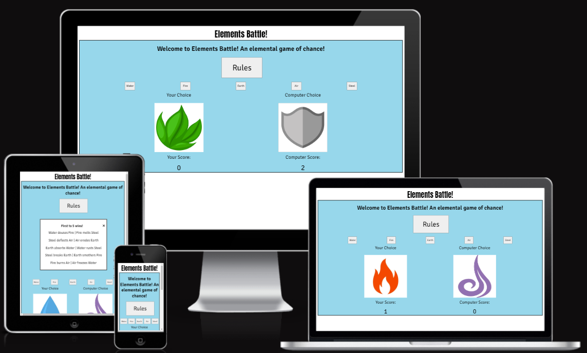
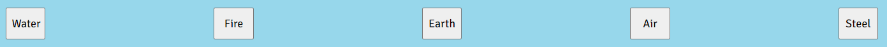

# Elements Battle
Elements Battle is a webiste that allows users to play a game themed around the interactions of 5 different elements based on  "Rock, Paper Scissors, Lizard, Spock". The site's target user is anyone wishing to play a game with elements of chance.

## Features
The site's html has been constructed to provide an uncomplicated layout. Aside from the title, it also contains an explanation of the rules of the game and an area for displaying the player's choice and the computers, as well as a counter to keep track of the player's score and the computer's.

### Rules
Explains how the various interactions work

### Options
Allows the user to select their element for a given round

### Graphics
Displays the elements selected by the player and the computer for the round

### Scoreboard
Tracks number of player & computer wins

## Testing
Manual testing was conducted after the implementation of the javaScript to govern the interactions of the various elements by selecting each one in turn until the computer had cycled through all of the options to test that they had been implemented correctly. console.log() was used to confirm that these worked

|Test|Outcome|
|Testing button for each element to ensure each selected the right one|Passed|

### Validation
The HTML, CSS and javaScript were each run through the relevant validator websites, W3C for HTML and JavaScript, Jigsaw for CSS 

## Bugs
Alignment of score areas was not in complete sync with picture areas, this was due to  them being in a separate div and not arrayed in a column

The function to display computer choices initially didn't work, on examination of code realised this was because the onclick attribute had not been added to the buttons. Once added, initially got an error message on clicking the buttons because options were not defined. Once defined, testing would not return steel as a computer choice. This was due to the math function being used incorrectly - multiplication factor of 4 was being used on the random number generated to attempt to capture steel in the array of choices, not realising that 5 was the correct factor as math.floor was being used in conjunction with math.random

On introduction of a switch statement to govern choice interactions, an error was produced to say the gameManager function was undefined. previously when using console.log to display computer selections, this had worked and the computer's pick had been shown. This was due to the switch statement outcome not being assigned to the result of the function. A further problem arose when 2 alerts were being displayed for all outcomes except draws. attempts to rectify this by using a separate interaction for each other element resulted in the gameManager error arising again. The error was corrected by inserting a break between each line of the switch statement used to create the interactions, and by combining the previous 2 lines of each case into one line using || between options for that case. 

Initial attempts to change the pictures displayed according to the player's and computer's choice were unsuccessful. This was remedied through use of classes that changed whether the display of an image was set to none or block, and setting the gameManager function to add or remove these classes to given images depending on what the player chose. A subsequent issue was found in the images only displaying for the player's choice, and the alert arising before the image changed. This was rectified and a subsequent problem emerged in the computer's image not relating to its choice. On re-examination of the code, it was determined that the old system was making the computer's image be chosen separately from its choice of element, resulting in a disconnect between the two. The code was changed so that the results of the gameManager function fed into the setPicture function, resulting in the computer's image, matching its chosen element. A final problem was images stacking on top of each other in the game areas. This was resolved by expanding the if statements governing the display of images to add and remove the class conferring visibility on each button click.

On adding the function to increment the player's score on a win, initial attempts to implement it were unsuccessful as the call for the score function could not be added successfully to the gameManager function. Subsequent testing revealed that the function to increment the score had not been referencing the correct element in the html. On fixing this, a new bug emerged as the player's score would not increment past 1. On adding the function to increase the computer's score, it initially didn't work. On re-examination of the code, the line in the function to update the computer's score that updated the element's inner html was not referencing the correct variable. On correction, it worked properly, and on implementation of both functions across all outcomes, the scores continued past 1. 

The functions to increase the player's and computer's scores were modified to introduce a "lives" system to make the game more interesting, with the first to 5 victories being the winner. There was an issue with the order of operations in this, as the alert to say a game was won or lost was declared before the score rolled over to 5. (SOLUTION). The functions were then further modified to reset the page on closing the alert. but the order of operations was again an issue, and the player could no longer see the outcome of the final round. (SOLUTION) Additionally, the alert was being displayed twice. This was because the alert was writteon on its own as well as being part of the if statement to reset the page. On removing the one on its own. the alert only displayed once.

## Deplyoment
### This was done by using the following steps:
1. Going to the Settings page in the repository on GitHub
2. Selecting Pages on the menu on the left hand side of that page
3. Selecting "Deploy from a Branch" in the section marked Sourcxe and ensuring that the branch was set to main and the folder was set to /root.
4. Selecting save under branch
5. Navigating back to the repository's code page, then refreshing after a few minutes
6. moving to the deployments section on the right side of the code page and opening the link from there

## Credits
The following was used as a reference to help solve the bug of the computer displaying the wrong pictures: https://stackoverflow.com/questions/30179489/how-do-i-make-images-change-with-a-rock-paper-scissors-game

The functions used in LoveMaths to increment scores were used as a template to achieve the same goal here

The following tutorial was used to help write the gameManager function https://www.youtube.com/watch?v=3uKdQx-SZ5A&t=697s 

The following was used to help implement the vicotry/game over states: https://stackoverflow.com/questions/16955019/how-to-reload-a-page-after-the-ok-click-on-the-alert-page

The images used in the site were taken from the following sources:
Water image: https://www.stockio.com/free-icon/nature-icons-water-drop?utm_content=cmp-true
Fire image: https://stock.adobe.com/search?k=fire+icon&asset_id=235263034
Earth image: https://www.vecteezy.com/vector-art/9660869-earth-element-nature-vector-round-icon-for-design
Air image: https://www.vectorstock.com/royalty-free-vector/abstract-air-symbol-vector-18170953
Steel image: https://www.vecteezy.com/vector-art/35241602-silver-shield-icon-flat-vector-design-heraldic-symbol-award-badge-shape-medieval-metal-weapons
Question Mark image: https://www.iconsdb.com/white-icons/question-mark-icon.html
Favicon: https://icons8.com/icons/set/fire

## Acknowledgements
I wish to acknowledge my mentor, Alan Bushell, who provided me with feedback and advice throughout this project. I wish also to acknowledge the Code Institute tutors, who provided valuable advice and insight when I had questions